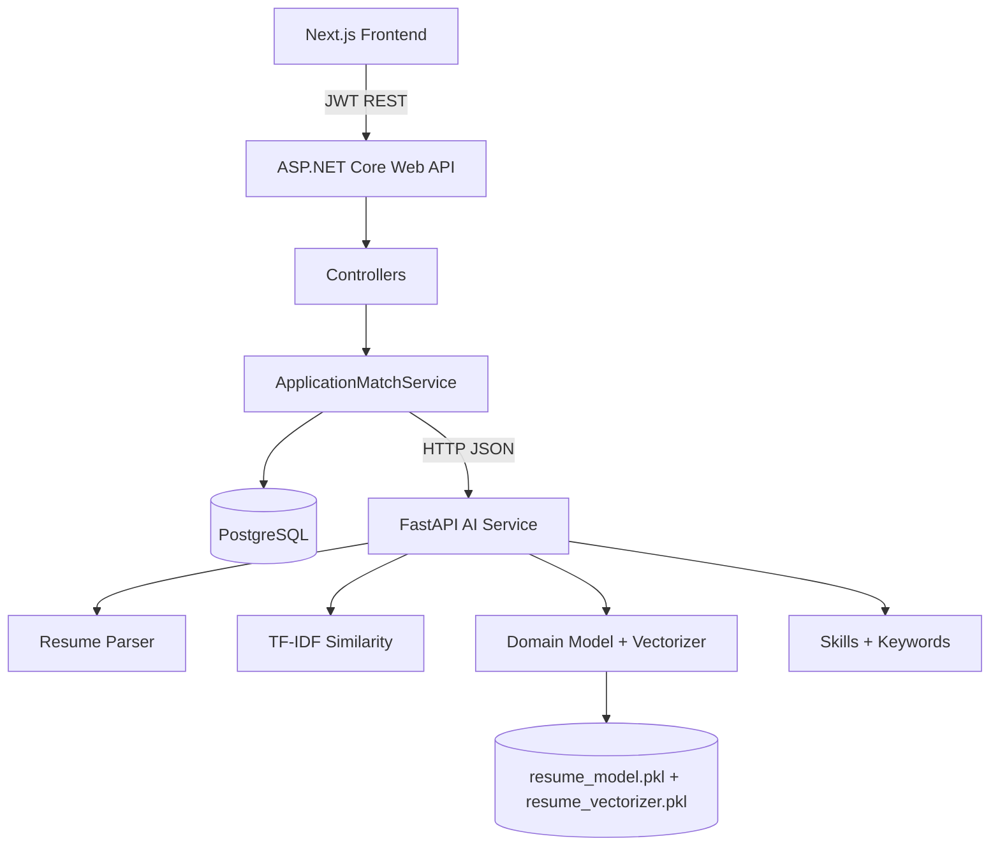
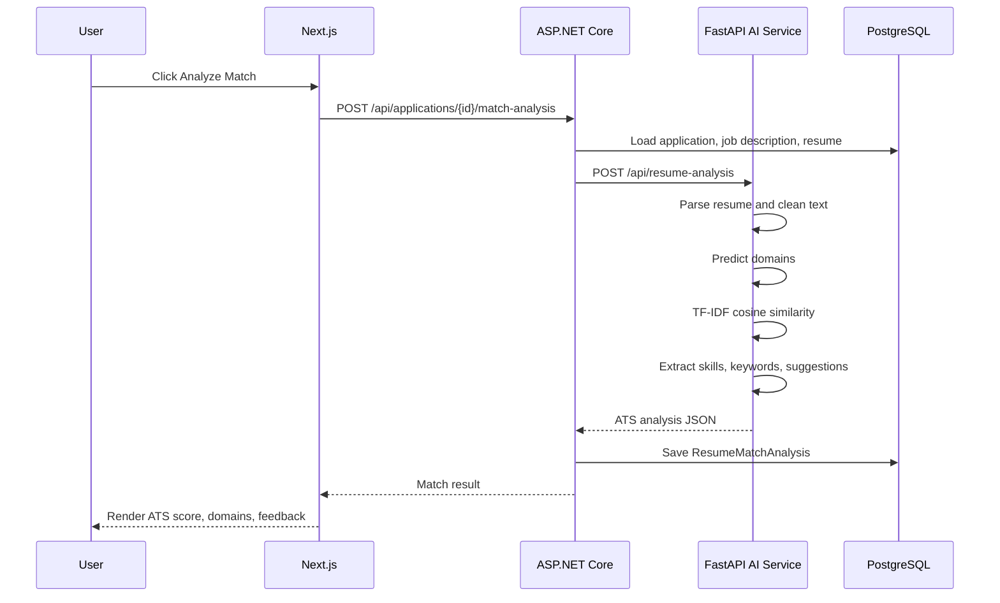

# ApplyFlow AI Service Integration

## Source Project Analysis

Source archive: `AI-ATS-Resume-Analyser-main.zip`

The source project is a Node/Express API that shells out to Python scripts for machine-learning work.

Implemented source capabilities identified:

- Trained domain prediction model: `ml/resume_model.pkl`
- TF-IDF vectorizer artifact: `ml/resume_vectorizer.pkl`
- Model loading: `predict_domain.py` loads both artifacts with `joblib.load`
- Domain prediction: vectorizer transforms input text, model predicts resume/job domain
- Similarity: `similarity.py` calculates TF-IDF cosine similarity between resume and job description
- Keyword extraction: `keywords.py` uses `TfidfVectorizer(stop_words="english", max_features=15)`
- Resume parsing: Node utility uses `pdf-parse` for PDF buffers
- Skill extraction utility: static skill list in `backend/utils/skillsList.js`
- ATS scoring formula from source controller:
  - similarity: 45%
  - domain match: 25%
  - skill score: 30%
- Source API endpoints:
  - `POST /api/resume/analyze`
  - `GET /api/resume/history`
- Source storage: `Analysis` model through Sequelize/PostgreSQL

Important correction:

- The source Node controller multiplied a percentage similarity by `100` again. The ApplyFlow integration keeps similarity as `0-100` and clamps the final ATS score to `0-100`.

## Updated Folder Structure

```text
Apply Flow/
  ai-service/
    app/
      analyzer.py
      main.py
      models.py
      text_processing.py
    models/
      resume_model.pkl
      resume_vectorizer.pkl
    Dockerfile
    requirements.txt
  ApplyFlow-Backend/
    ApplyFlow-Backend/
      DTOs/AiService/
      Services/AiResumeAnalysisClient.cs
      Services/IAiResumeAnalysisClient.cs
      Services/LocalResumeAnalysisClient.cs
      Migrations/*AddAiResumeAnalysisMetadata*
  applyflow-frontend/
    components/applications/application-match-workspace.tsx
    types/application-match.ts
  docker-compose.yml
```

## Integration Plan

1. Keep Next.js communicating only with ASP.NET Core.
2. Move AI scoring, parsing, domain prediction, TF-IDF similarity, keyword extraction, and suggestions into `ai-service`.
3. Load trained `.pkl` artifacts once during FastAPI startup.
4. Add an ASP.NET typed HTTP client for the AI service.
5. Replace the old in-process keyword match in `ApplicationMatchService` with the AI service call.
6. Persist enriched AI metadata in `ResumeMatchAnalyses`.
7. Extend the existing frontend match result UI to show similarity, skill score, domain score, domains, feedback, and suggestions.

## Architecture Diagram



## API Flow

```text
Next.js
  -> POST /api/applications/{id}/match-analysis
ASP.NET Core
  -> verifies JWT and application ownership
  -> loads resume bytes and job description from PostgreSQL
  -> POST ai-service /api/resume-analysis
FastAPI
  -> parses resume
  -> predicts resume/job domains
  -> calculates TF-IDF cosine similarity
  -> extracts skills and keywords
  -> calculates ATS score
  -> returns analysis JSON
ASP.NET Core
  -> persists analysis metadata
  -> returns existing frontend response shape plus AI fields
```

## Sequence Diagram



## FastAPI Endpoints

- `GET /health`
- `POST /api/resume-analysis`
- `POST /api/ats-score`
- `POST /api/match`
- `POST /api/skills`
- `POST /api/domain`
- `POST /api/keywords`
- `POST /api/suggestions`

## Database Changes

Migration: `AddAiResumeAnalysisMetadata`

Added nullable/additive columns to `ResumeMatchAnalyses`:

- `ResumeDomain`
- `JobDescriptionDomain`
- `SimilarityPercent`
- `SkillScore`
- `DomainScore`
- `Feedback`
- `ResumeSkillsJson`
- `JobDescriptionSkillsJson`

Existing analysis fields remain unchanged:

- `MatchScore`
- `MatchedKeywordsJson`
- `MissingKeywordsJson`
- `SuggestionsJson`

## Runtime Configuration

Backend configuration:

```json
"AiService": {
  "BaseUrl": "http://localhost:8000",
  "TimeoutSeconds": 30
}
```

Docker Compose uses:

```text
AiService__BaseUrl=http://ai-service:8000
```

## Notes

- The Node/Express source wrapper was not copied into ApplyFlow because ASP.NET Core already owns the backend API layer.
- The trained model artifacts were reused directly.
- The fallback `LocalResumeAnalysisClient` keeps backend unit tests independent from the Python service.
