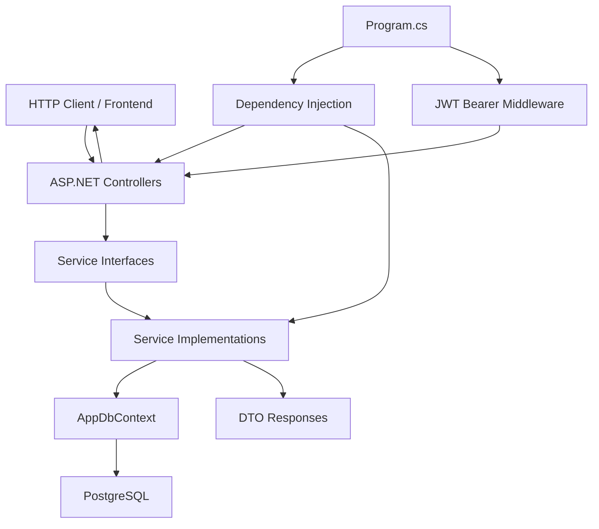
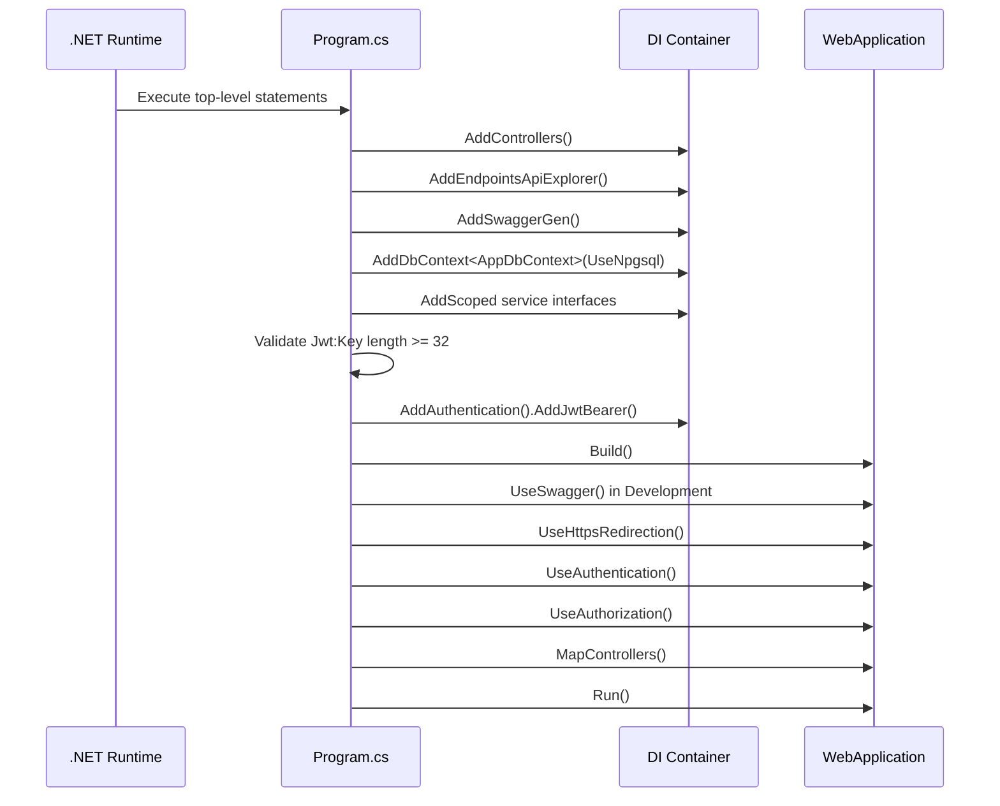
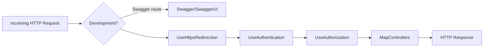
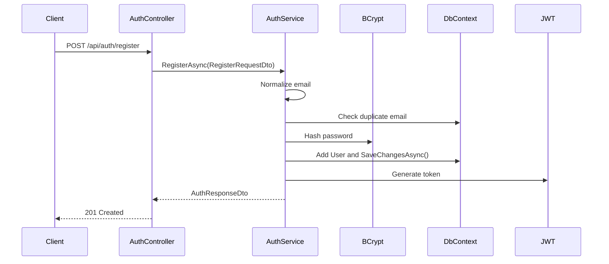
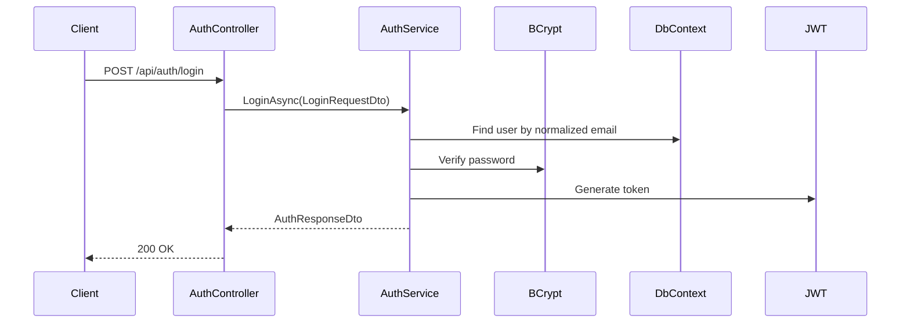
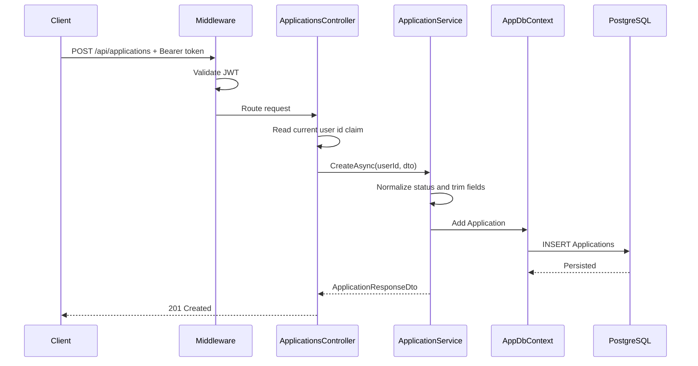
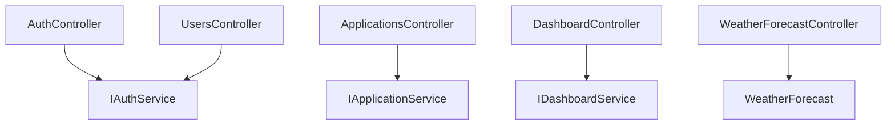
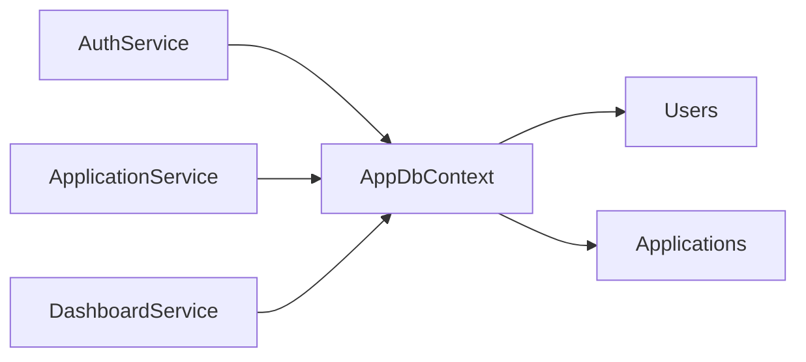
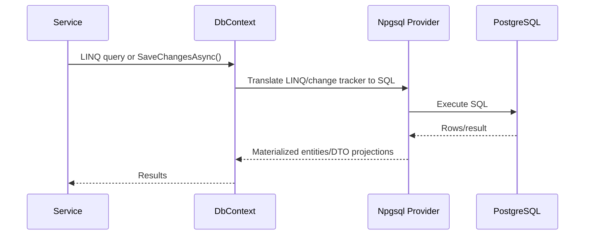

# ApplyFlow AI - Backend Master Documentation

Current implementation documented from `D:\Asp.Net\Apply Flow\ApplyFlow-Backend` on 2026-06-24.

This document describes only what exists in the current backend codebase. It does not describe planned AI features, future modules, or assumed production infrastructure.

## 1. Project Overview

ApplyFlow AI backend is an ASP.NET Core Web API that provides authentication, user profile lookup, job application management, and dashboard aggregation APIs.

The backend currently supports:

- User registration and login.
- JWT creation and JWT bearer validation.
- Current user lookup through `GET /api/users/me`.
- CRUD operations for job applications.
- Dashboard summary, status distribution, and monthly application statistics.
- Swagger/OpenAPI in development.
- PostgreSQL persistence through Entity Framework Core and Npgsql.
- Unit tests for the service layer using EF Core InMemory.
- A starter `WeatherForecast` endpoint that still exists in the project.

## 2. Technology Stack

| Area | Current technology |
| --- | --- |
| Runtime/framework | ASP.NET Core Web API targeting `net10.0` |
| Database access | Entity Framework Core 10 |
| Database provider | Npgsql Entity Framework Core PostgreSQL |
| Database | PostgreSQL, configured as `ApplyFlowDB` on localhost |
| Authentication | JWT bearer authentication |
| Password hashing | `BCrypt.Net-Next` |
| API docs | Swashbuckle Swagger |
| Tests | xUnit, Microsoft.NET.Test.Sdk, EF Core InMemory |
| Configuration | `appsettings.json`, `appsettings.Development.json`, launch profiles |

## 3. Folder Structure

```text
ApplyFlow-Backend/
  ApplyFlow-Backend.slnx
  applyflow_dotnet_starter_project.md
  ApplyFlow AI - Software Requirements Specification.pdf
  ApplyFlow-Backend/
    Program.cs
    ApplyFlow-Backend.csproj
    ApplyFlow-Backend.http
    appsettings.json
    appsettings.Development.json
    WeatherForecast.cs
    Controllers/
    Data/
    DTOs/
      Auth/
      Applications/
      Dashboard/
    Migrations/
    Models/
    Properties/
    Services/
    ApplyFlow-Backend.Tests/
```

Folder responsibilities:

| Folder | Responsibility |
| --- | --- |
| `Controllers` | HTTP endpoint layer. Receives requests, extracts route/auth data, calls services, returns HTTP responses. |
| `Services` | Business logic layer. Implements auth, application management, and dashboard aggregation. |
| `DTOs` | API request/response shapes. Keeps external contracts separate from EF entities. |
| `Models` | EF Core entity classes persisted to PostgreSQL. |
| `Data` | EF Core `DbContext` and model configuration. |
| `Migrations` | EF Core schema history and current model snapshot. |
| `Properties` | ASP.NET launch profiles. |
| `ApplyFlow-Backend.Tests` | Service-layer unit tests using EF Core InMemory. |

## 4. Architecture Diagram



## 5. Startup Flow

`Program.cs` is the application entry point.



Startup details:

- Controllers are enabled with `builder.Services.AddControllers()`.
- Swagger is configured with a Bearer token security definition.
- `AppDbContext` uses the `DefaultConnection` connection string.
- `IAuthService`, `IApplicationService`, and `IDashboardService` are registered as scoped services.
- JWT configuration is validated at startup. The app throws if `Jwt:Key` is missing or shorter than 32 characters.
- JWT bearer validation checks issuer, audience, expiration, and signing key.

## 6. Middleware Flow



Current middleware order:

1. Swagger and Swagger UI in development only.
2. HTTPS redirection.
3. Authentication.
4. Authorization.
5. Controller endpoint mapping.

There is no custom exception-handling middleware, CORS middleware, rate limiting, or request logging middleware in the current implementation.

## 7. Authentication Flow

Registration:



Login:



## 8. Authorization Flow

Protected controllers/actions use `[Authorize]`.

Current protected APIs:

- `GET /api/users/me`
- all `/api/applications` endpoints
- all `/api/dashboard` endpoints

Authorization sequence:

1. Client sends `Authorization: Bearer <token>`.
2. `UseAuthentication()` validates the token.
3. `UseAuthorization()` enforces `[Authorize]`.
4. Controller extracts the current user id from `ClaimTypes.NameIdentifier`.
5. Services receive the `Guid userId` and filter all user-owned records by that id.

## 9. JWT Flow

JWT creation is implemented in `AuthService.GenerateJwtToken`.

Token contents:

| Claim | Source |
| --- | --- |
| `sub` | `user.Id` |
| `email` | `user.Email` |
| `ClaimTypes.NameIdentifier` | `user.Id` |
| `ClaimTypes.Email` | `user.Email` |

Token validation is configured in `Program.cs`:

- `ValidateIssuer = true`
- `ValidateAudience = true`
- `ValidateLifetime = true`
- `ValidateIssuerSigningKey = true`
- issuer from `Jwt:Issuer`
- audience from `Jwt:Audience`
- symmetric HMAC SHA-256 signing key from `Jwt:Key`

Current token expiration:

- `Jwt:ExpiresInMinutes` from configuration.
- Falls back to `60` minutes if parsing fails.

## 10. Database Architecture

The backend uses EF Core with PostgreSQL.

Connection string in current `appsettings.json`:

```text
Host=localhost;Port=5432;Database=ApplyFlowDB;Username=postgres;Password=sami12
```

Current database tables from migrations/model snapshot:

| Table | Purpose |
| --- | --- |
| `Users` | Stores registered user identity data and password hashes. |
| `Applications` | Stores job application records associated with a `UserId`. |

## 11. Entity Relationships

```mermaid
erDiagram
    USERS {
        uuid Id PK
        varchar Email UK
        varchar PasswordHash
        timestamp CreatedAt
    }

    APPLICATIONS {
        uuid Id PK
        uuid UserId IDX
        varchar CompanyName
        varchar PositionTitle
        timestamp ApplicationDate
        varchar Status
        varchar Notes
        timestamp CreatedAt
    }

    USERS ||--o{ APPLICATIONS : "logical owner via UserId"
```

Important current detail: `Applications.UserId` has an index, but the current EF model does not configure a database foreign key relationship to `Users`. Ownership is enforced by service queries filtering on `UserId`.

## 12. Request Lifecycle

Example: create application.



## 13. Controllers Documentation

| Controller | Routes | Responsibilities |
| --- | --- | --- |
| `AuthController` | `POST /api/auth/register`, `POST /api/auth/login` | Receives auth DTOs, delegates to `IAuthService`, converts known exceptions into `400` or `401`. |
| `UsersController` | `GET /api/users/me` | Requires auth, extracts user id claim, returns current user profile without password hash. |
| `ApplicationsController` | CRUD under `/api/applications` | Requires auth, extracts user id, delegates application operations, maps not-found and validation errors. |
| `DashboardController` | `/api/dashboard/*` | Requires auth, extracts user id, returns dashboard aggregate DTOs. |
| `WeatherForecastController` | `GET /WeatherForecast` | Starter sample endpoint returning random forecast data. |

Controller-service interaction:



## 14. Services Documentation

| Service | Responsibility |
| --- | --- |
| `IAuthService` | Contract for register, login, and current-user lookup. |
| `AuthService` | Email normalization, duplicate checks, BCrypt hashing/verification, JWT creation, user response mapping. |
| `IApplicationService` | Contract for application CRUD operations. |
| `ApplicationService` | User-scoped CRUD, status normalization, trimming, notes normalization, response mapping. |
| `IDashboardService` | Contract for dashboard aggregate queries. |
| `DashboardService` | User-scoped count aggregation by status and month. |

Service-to-database flow:



## 15. DTO Documentation

Auth DTOs:

| DTO | Used by | Purpose |
| --- | --- | --- |
| `RegisterRequestDto` | `AuthController.Register` | Validates email and password, password minimum length 8. |
| `LoginRequestDto` | `AuthController.Login` | Validates email and password presence. |
| `AuthResponseDto` | register/login responses | Returns token, expiration, and user profile. |
| `UserResponseDto` | auth/current-user responses | Returns user id, email, created date without password hash. |

Application DTOs:

| DTO | Used by | Purpose |
| --- | --- | --- |
| `CreateApplicationRequestDto` | `ApplicationsController.Create` | Validated request for creating a job application. |
| `UpdateApplicationRequestDto` | `ApplicationsController.Update` | Validated request for updating a job application. |
| `ApplicationResponseDto` | application responses | Public application shape returned by service layer. |

Dashboard DTOs:

| DTO | Used by | Purpose |
| --- | --- | --- |
| `DashboardSummaryDto` | `GET /api/dashboard/summary` | Total and per-status counts. |
| `StatusDistributionDto` | `GET /api/dashboard/status-distribution` | Count per valid status. |
| `MonthlyStatsDto` | `GET /api/dashboard/monthly-stats` | Count grouped by year/month. |

## 16. Models Documentation

| Model | Persistence role |
| --- | --- |
| `User` | EF entity for `Users`. Stores `Id`, normalized `Email`, `PasswordHash`, `CreatedAt`. |
| `Application` | EF entity for `Applications`. Stores job application fields plus `UserId` owner id. |
| `WeatherForecast` | Starter sample response model for `WeatherForecastController`. Not connected to PostgreSQL. |

## 17. DbContext Documentation

`AppDbContext` inherits `DbContext` and exposes:

- `DbSet<User> Users`
- `DbSet<Application> Applications`

`OnModelCreating` configures:

- Primary keys for both entities.
- Required/max-length constraints.
- Unique index on `User.Email`.
- Index on `Application.UserId`.
- Notes max length of 2000.

EF flow:



## 18. Migrations Documentation

| Migration file | Current purpose |
| --- | --- |
| `20260624113728_InitialCreate.cs` | Creates initial `Applications` and `Users` tables. Initial application table used `AppliedDate`. |
| `20260624122817_AddUserAuthConstraints.cs` | Adds string lengths, unique user email index, and application user index. |
| `20260624130553_AddApplicationManagement.cs` | Renames `AppliedDate` to `ApplicationDate`; adds `CreatedAt` and nullable `Notes`. |
| `AppDbContextModelSnapshot.cs` | EF Core snapshot of the current model for future migration comparisons. |

Migration command already relevant to the project:

```powershell
dotnet ef database update
```

## 19. API Documentation

All JSON property names are serialized using ASP.NET Core defaults, which are camelCase for JSON.

| Method | Endpoint | Auth | Request | Response |
| --- | --- | --- | --- | --- |
| `POST` | `/api/auth/register` | No | `{ email, password }` | `201 AuthResponseDto` or `400 { message }` |
| `POST` | `/api/auth/login` | No | `{ email, password }` | `200 AuthResponseDto` or `401 { message }` |
| `GET` | `/api/users/me` | Yes | none | `200 UserResponseDto`, `401`, or `404` |
| `POST` | `/api/applications` | Yes | create application DTO | `201 ApplicationResponseDto` or `400` |
| `GET` | `/api/applications` | Yes | none | `200 ApplicationResponseDto[]` |
| `GET` | `/api/applications/{id}` | Yes | route `Guid id` | `200 ApplicationResponseDto` or `404` |
| `PUT` | `/api/applications/{id}` | Yes | update application DTO | `200 ApplicationResponseDto`, `400`, or `404` |
| `DELETE` | `/api/applications/{id}` | Yes | route `Guid id` | `204` or `404` |
| `GET` | `/api/dashboard/summary` | Yes | none | `200 DashboardSummaryDto` |
| `GET` | `/api/dashboard/status-distribution` | Yes | none | `200 StatusDistributionDto[]` |
| `GET` | `/api/dashboard/monthly-stats` | Yes | none | `200 MonthlyStatsDto[]` |
| `GET` | `/WeatherForecast` | No | none | `200 WeatherForecast[]` |

## 20. Security Documentation

Current security implementation:

- Passwords are never stored as plain text; `AuthService` hashes with BCrypt.
- Login verifies with BCrypt.
- JWT signing uses HMAC SHA-256 and a symmetric key.
- Startup rejects weak/missing JWT keys shorter than 32 characters.
- Protected endpoints use `[Authorize]`.
- User-scoped application/dashboard queries filter by `UserId` from JWT claims.
- `UserResponseDto` excludes `PasswordHash`.

Current security gaps to know for review:

- `appsettings.json` currently contains a local PostgreSQL password and JWT key.
- No CORS policy is configured.
- No refresh token implementation exists.
- No account lockout, email confirmation, or rate limiting exists.
- No global exception middleware exists.
- `Applications.UserId` has no EF-configured foreign key.

These are observations of current implementation, not future requirements.

## 21. Validation Implementation

Validation sources:

- `[ApiController]` automatically performs model validation for data annotations.
- DTOs use `[Required]`, `[EmailAddress]`, `[MinLength]`, and `[MaxLength]`.
- `ApplicationService.NormalizeStatus` enforces valid statuses:
  - `Applied`
  - `Screening`
  - `Interview`
  - `Offer`
  - `Rejected`
  - `Withdrawn`
- `ApplicationService` trims company name, position title, and notes.
- `AuthService` normalizes email by trimming and lowercasing.

## 22. Error Handling

Current explicit error handling:

| Location | Error | HTTP response |
| --- | --- | --- |
| `AuthController.Register` | `InvalidOperationException` from duplicate email | `400 { message }` |
| `AuthController.Login` | `UnauthorizedAccessException` from invalid credentials | `401 { message }` |
| `UsersController.Me` | Invalid/missing user id claim | `401 { message }` |
| `UsersController.Me` | User not found | `404 { message }` |
| `ApplicationsController.Create/Update` | `ArgumentException` from invalid status | `400 { message }` |
| `ApplicationsController.GetById/Update/Delete` | Not found/user mismatch | `404 { message }` or `204` for successful delete |

Unhandled exceptions use ASP.NET Core default behavior because no custom global exception middleware is currently implemented.

## 23. Testing Structure

Tests live inside `ApplyFlow-Backend/ApplyFlow-Backend/ApplyFlow-Backend.Tests`.

| Test file | Coverage |
| --- | --- |
| `AuthServiceTests.cs` | Register creates hashed password and token; duplicate email; login success/failure; current user response excludes password hash. |
| `ApplicationServiceTests.cs` | Create trims/normalizes fields; user isolation for list/update; invalid status throws. |
| `DashboardServiceTests.cs` | Summary counts only current user; monthly stats groups by month. |
| `ApplyFlow-Backend.Tests.csproj` | xUnit, EF Core InMemory, coverage collector, project reference. |

Test data uses fresh in-memory database names (`Guid.NewGuid().ToString()`) per test helper.

Run tests:

```powershell
cd "D:\Asp.Net\Apply Flow\ApplyFlow-Backend\ApplyFlow-Backend"
dotnet test
```

## 24. File Dependency Map

| File | Why it exists / problem solved | If removed | Depends on | Called by / used by |
| --- | --- | --- | --- | --- |
| `Program.cs` | Bootstraps DI, EF, Swagger, JWT middleware, pipeline. | App cannot start. | Services, Data, configuration, ASP.NET packages. | .NET runtime. |
| `ApplyFlow-Backend.csproj` | Defines target framework and NuGet packages. | Project cannot build. | NuGet packages. | `dotnet build/test/run`. |
| `appsettings.json` | Stores logging, DB connection, JWT config. | Runtime config missing; DB/JWT may fail. | none. | `Program.cs`, `AuthService`. |
| `appsettings.Development.json` | Development logging overrides. | Development still runs using base config only. | none. | ASP.NET configuration system. |
| `Properties/launchSettings.json` | Local HTTP/HTTPS launch URLs and environment. | Local launch profiles disappear. | none. | `dotnet run`, IDE. |
| `ApplyFlow-Backend.http` | Manual HTTP scratch request for weather endpoint. | Manual sample request gone. | launch URL. | IDE REST client. |
| `Data/AppDbContext.cs` | EF database context and schema configuration. | Services cannot query/persist data. | Models, EF Core. | Auth/Application/Dashboard services, tests, migrations. |
| `Models/User.cs` | User persistence entity. | Auth and user table mapping break. | none. | `AppDbContext`, `AuthService`, tests. |
| `Models/Application.cs` | Application persistence entity. | Application and dashboard features break. | none. | `AppDbContext`, `ApplicationService`, `DashboardService`, tests. |
| `WeatherForecast.cs` | Starter sample response model. | Weather endpoint cannot compile. | none. | `WeatherForecastController`. |
| `Controllers/AuthController.cs` | Auth HTTP API. | Register/login endpoints gone. | Auth DTOs, `IAuthService`. | HTTP routing. |
| `Controllers/UsersController.cs` | Current-user API. | Frontend session refresh cannot fetch `/api/users/me`. | `IAuthService`, claims. | HTTP routing. |
| `Controllers/ApplicationsController.cs` | Application CRUD API. | Application management endpoints gone. | Application DTOs, `IApplicationService`, claims. | HTTP routing. |
| `Controllers/DashboardController.cs` | Dashboard aggregate API. | Dashboard endpoints gone. | `IDashboardService`, claims. | HTTP routing. |
| `Controllers/WeatherForecastController.cs` | Starter sample API. | `/WeatherForecast` gone. | `WeatherForecast`. | HTTP routing. |
| `Services/IAuthService.cs` | Auth abstraction for DI/controllers. | Controllers/tests lose contract. | Auth DTOs. | `AuthController`, `UsersController`, DI. |
| `Services/AuthService.cs` | Auth business logic, password hashing, JWT generation. | Auth features fail. | `AppDbContext`, config, BCrypt, JWT packages. | `IAuthService` consumers. |
| `Services/IApplicationService.cs` | Application service contract. | Controller DI contract breaks. | Application DTOs. | `ApplicationsController`, DI. |
| `Services/ApplicationService.cs` | Application CRUD business rules. | Application APIs cannot operate. | `AppDbContext`, Application model/DTOs. | `ApplicationsController`, `DashboardService.ValidStatuses`, tests. |
| `Services/IDashboardService.cs` | Dashboard service contract. | Dashboard controller DI breaks. | Dashboard DTOs. | `DashboardController`, DI. |
| `Services/DashboardService.cs` | Dashboard aggregation queries. | Dashboard endpoints fail. | `AppDbContext`, Dashboard DTOs, `ApplicationService.ValidStatuses`. | `DashboardController`, tests. |
| `DTOs/Auth/RegisterRequestDto.cs` | Register request contract/validation. | Registration action cannot compile. | DataAnnotations. | `AuthController`, `AuthService`, tests. |
| `DTOs/Auth/LoginRequestDto.cs` | Login request contract/validation. | Login action cannot compile. | DataAnnotations. | `AuthController`, `AuthService`, tests. |
| `DTOs/Auth/AuthResponseDto.cs` | Auth response with token/user. | Register/login response mapping fails. | `UserResponseDto`. | `AuthService`, auth controller responses. |
| `DTOs/Auth/UserResponseDto.cs` | Safe public user shape. | Current-user/auth responses fail or risk exposing entity. | none. | `AuthService`, `AuthResponseDto`. |
| `DTOs/Applications/CreateApplicationRequestDto.cs` | Create request validation. | Create endpoint cannot compile. | DataAnnotations. | `ApplicationsController`, `ApplicationService`, tests. |
| `DTOs/Applications/UpdateApplicationRequestDto.cs` | Update request validation. | Update endpoint cannot compile. | DataAnnotations. | `ApplicationsController`, `ApplicationService`, tests. |
| `DTOs/Applications/ApplicationResponseDto.cs` | Public application response shape. | Application responses fail. | none. | `ApplicationService`, controllers. |
| `DTOs/Dashboard/DashboardSummaryDto.cs` | Dashboard summary response. | Summary endpoint cannot compile. | none. | `DashboardService`, controller. |
| `DTOs/Dashboard/StatusDistributionDto.cs` | Status distribution response. | Distribution endpoint cannot compile. | none. | `DashboardService`, controller. |
| `DTOs/Dashboard/MonthlyStatsDto.cs` | Monthly stats response. | Monthly stats endpoint cannot compile. | none. | `DashboardService`, controller. |
| `Migrations/*.cs` | Database schema history. | EF database updates/history are incomplete. | EF Core. | `dotnet ef`. |
| `Migrations/AppDbContextModelSnapshot.cs` | Current EF model snapshot. | Future migrations may be incorrect. | `AppDbContext`, EF Core. | EF tooling. |
| `ApplyFlow-Backend.Tests/*.cs` | Unit tests for services. | Automated service validation lost. | Services, DTOs, Models, EF InMemory, xUnit. | `dotnet test`. |
| `ApplyFlow-Backend.Tests.csproj` | Test project dependencies/reference. | Tests cannot build/run. | xUnit, EF InMemory, backend project. | `dotnet test`. |
| `ApplyFlow-Backend.slnx` | Solution file. | Solution-level tooling may not load. | backend project. | IDE/dotnet solution tooling. |
| `applyflow_dotnet_starter_project.md` | Project starter notes. | Documentation note removed; runtime unaffected. | none. | Humans. |
| `ApplyFlow AI - Software Requirements Specification.pdf` | Requirements artifact. | Reference document removed; runtime unaffected. | none. | Humans. |
| `Codex Documentation.txt` | Existing text documentation artifact. | Runtime unaffected. | none. | Humans. |
| `ApplyFlow-Backend.csproj.user` | User-specific IDE metadata. | Runtime/build generally unaffected. | IDE. | IDE. |

## 25. Deployment Notes

Current deployment-relevant facts:

- The backend is configured to run locally at `http://localhost:5267` and `https://localhost:7064`.
- PostgreSQL must be reachable with the configured `DefaultConnection`.
- Database schema must be applied with EF migrations.
- JWT settings must be present and consistent across token creation and validation.
- Swagger is enabled only when `app.Environment.IsDevelopment()` is true.
- No production-specific config file, Dockerfile, CI pipeline, or deployment manifest exists in the current codebase.

Minimal local run:

```powershell
cd "D:\Asp.Net\Apply Flow\ApplyFlow-Backend\ApplyFlow-Backend"
dotnet restore
dotnet ef database update
dotnet run --launch-profile http
```

## 26. Interview Explanation Section

Beginner explanation:

ApplyFlow AI backend is a Web API. A frontend sends HTTP requests. Controllers receive those requests. Services perform business logic. Entity Framework Core talks to PostgreSQL. DTOs define what data comes in and goes out. JWT tokens prove which user is making a protected request.

Professional explanation:

The backend follows a layered controller-service-data architecture. `Program.cs` composes the application by registering controllers, Swagger, EF Core, scoped services, and JWT bearer authentication. Controllers remain thin: they parse route/body/auth context, delegate work to service interfaces, and translate known business outcomes into HTTP responses. Services own domain behavior such as email normalization, password hashing, token generation, status normalization, user-scoped data access, and aggregate dashboard queries. EF Core maps `User` and `Application` entities to PostgreSQL tables and migrations preserve schema evolution.

Security explanation:

Passwords are hashed with BCrypt before persistence. Login verifies the hash instead of comparing plain text. Successful register/login returns a signed JWT containing the user id and email. Protected endpoints require a valid bearer token. Controllers extract `ClaimTypes.NameIdentifier` and pass it to services. Services filter all application/dashboard data by that id, which prevents a token holder from reading another user's records through normal API paths.
