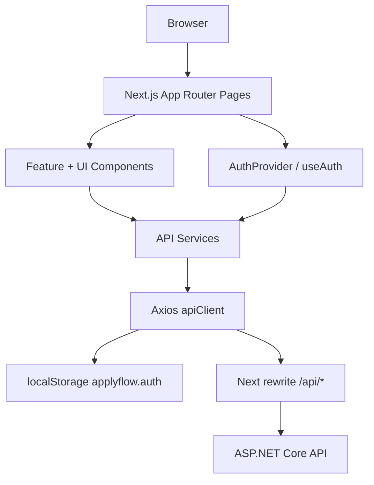
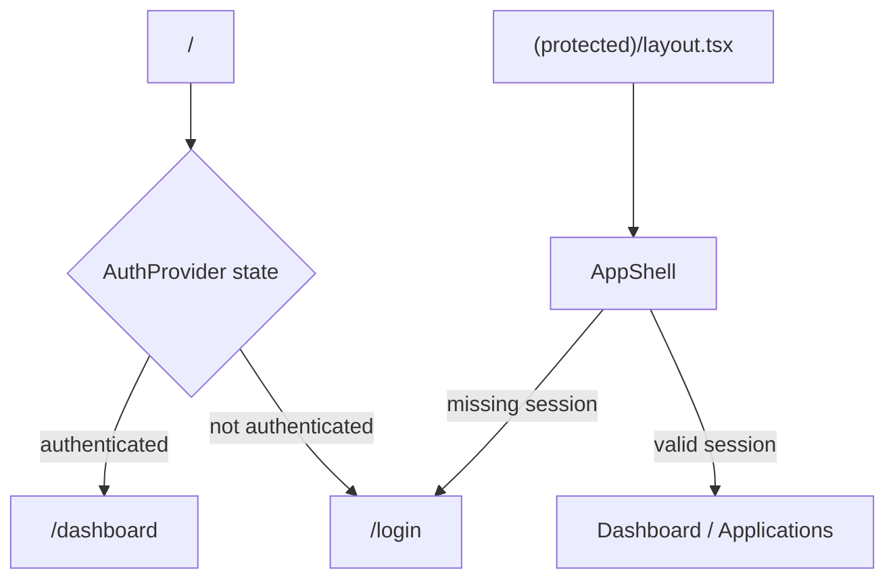
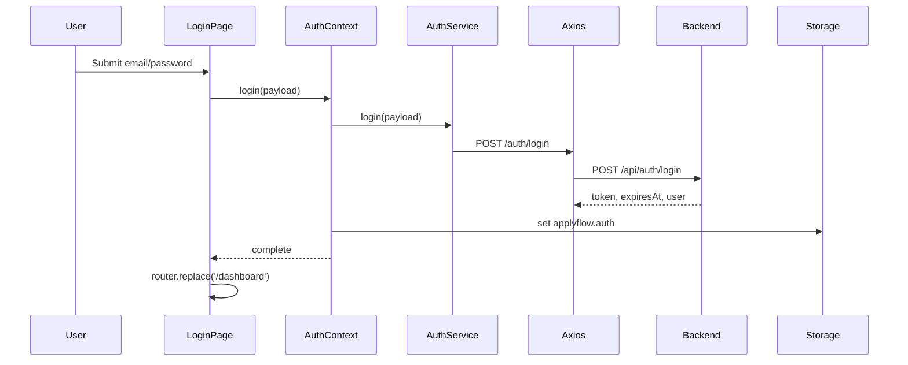
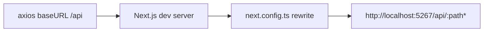
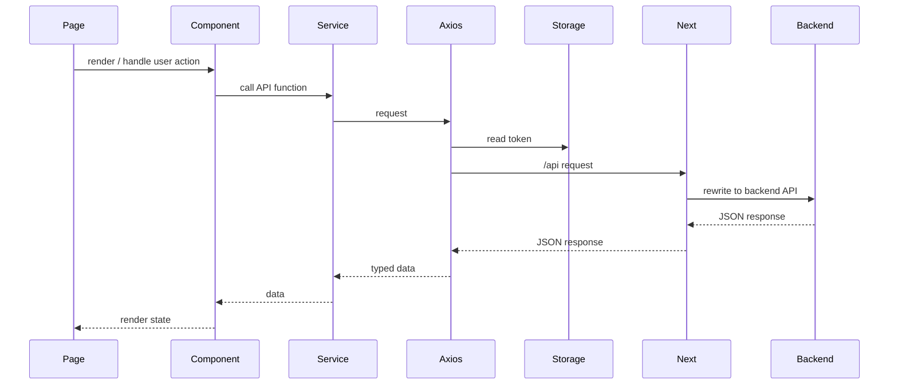
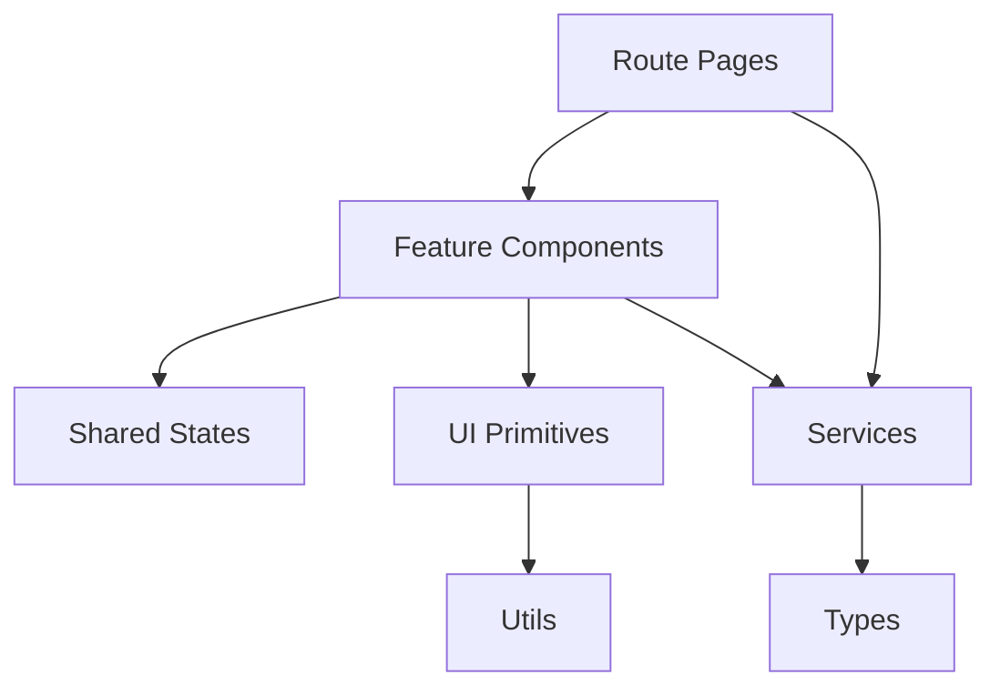
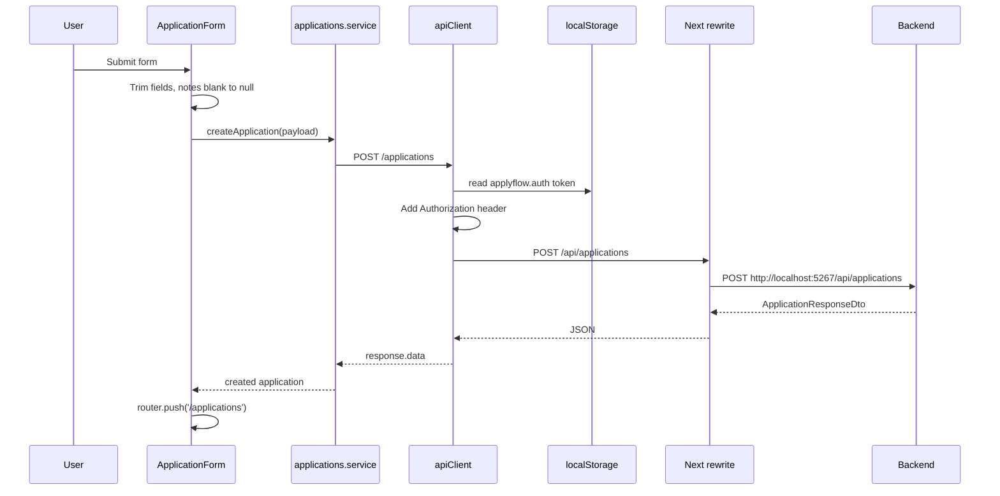

# ApplyFlow AI - Frontend Master Documentation

Current implementation documented from `D:\Asp.Net\Apply Flow\applyflow-frontend` on 2026-06-24.

This document describes only the current frontend codebase. It does not document future AI features or screens that are not implemented.

## 1. Frontend Architecture

The frontend is a Next.js App Router application using TypeScript, TailwindCSS, Shadcn-style local UI primitives, Axios, and a React auth context.

Main responsibilities:

- Route users to login/register or the protected application area.
- Store and restore JWT auth session in `localStorage`.
- Attach JWT bearer tokens to Axios requests.
- Proxy `/api/*` requests to the ASP.NET backend during local development.
- Render dashboard data from real dashboard APIs.
- Render application list, create, edit, and delete workflows from real application APIs.



## 2. Folder Structure

```text
applyflow-frontend/
  app/
    (auth)/
      login/page.tsx
      register/page.tsx
    (protected)/
      layout.tsx
      dashboard/page.tsx
      applications/page.tsx
      applications/new/page.tsx
      applications/[id]/edit/page.tsx
    layout.tsx
    page.tsx
    globals.css
    favicon.ico
  components/
    applications/
    dashboard/
    layout/
    shared/
    ui/
  context/
  lib/
  services/
  types/
  public/
  package.json
  next.config.ts
  tsconfig.json
  eslint.config.mjs
  postcss.config.mjs
```

Folder responsibilities:

| Folder | Responsibility |
| --- | --- |
| `app` | Next.js routes, layouts, and global CSS. |
| `components/applications` | Application form and table workflows. |
| `components/dashboard` | Dashboard summary/status/monthly display components. |
| `components/layout` | Authenticated app shell and header. |
| `components/shared` | Generic loading, error, and empty states. |
| `components/ui` | Local Shadcn-style UI primitives. |
| `context` | React auth context and `useAuth` hook. |
| `lib` | Axios client support, storage, routes, errors, formatting utilities. |
| `services` | API modules for auth, users, applications, and dashboard. |
| `types` | TypeScript interfaces mirroring backend DTOs. |
| `public` | Static SVG assets from the starter template. |

## 3. Routing Flow

Current routes:

| Route | File | Type | Purpose |
| --- | --- | --- | --- |
| `/` | `app/page.tsx` | Client redirect route | Sends authenticated users to dashboard and others to login. |
| `/login` | `app/(auth)/login/page.tsx` | Public client page | Login form. |
| `/register` | `app/(auth)/register/page.tsx` | Public client page | Register form. |
| `/dashboard` | `app/(protected)/dashboard/page.tsx` | Protected client page | Dashboard aggregates. |
| `/applications` | `app/(protected)/applications/page.tsx` | Protected client page | Application table. |
| `/applications/new` | `app/(protected)/applications/new/page.tsx` | Protected page | Create application form. |
| `/applications/[id]/edit` | `app/(protected)/applications/[id]/edit/page.tsx` | Protected client page | Load one application and edit it. |



## 4. Authentication Flow

Login:



Register follows the same frontend session persistence pattern but calls `POST /auth/register`. The register page validates password confirmation locally and sends only `{ email, password }` to the backend.

## 5. JWT Storage Flow

The current implementation stores the entire `AuthSession` in browser `localStorage` under key:

```text
applyflow.auth
```

Stored shape:

```ts
{
  token: string;
  expiresAt: string;
  user: { id: string; email: string; createdAt: string; };
}
```

Storage functions:

- `getStoredSession()` reads and parses localStorage. Invalid JSON is cleared.
- `setStoredSession(session)` writes JSON.
- `clearStoredSession()` removes the key.

## 6. Protected Route Flow

`app/(protected)/layout.tsx` wraps protected pages with `AppShell`.

`AppShell` behavior:

1. Reads `isLoading` and `isAuthenticated` from `useAuth`.
2. Shows `LoadingState` while auth is being restored.
3. Redirects unauthenticated users to `/login`.
4. Renders `AppHeader` and protected page content only when authenticated.

## 7. Axios Flow

`lib/api-client.ts` creates a shared Axios instance:

- `baseURL`: `NEXT_PUBLIC_API_BASE_URL` if set, otherwise `/api`.
- `Content-Type`: `application/json`.
- Request interceptor reads localStorage through `getStoredSession()`.
- If a token exists, it adds `Authorization: Bearer <token>`.

Local development proxy:



## 8. API Integration Flow

Service files hide endpoint details from pages/components.

| Service file | Backend APIs |
| --- | --- |
| `auth.service.ts` | `POST /auth/login`, `POST /auth/register` through `/api` base URL. |
| `users.service.ts` | `GET /users/me`. |
| `applications.service.ts` | `GET/POST /applications`, `GET/PUT/DELETE /applications/{id}`. |
| `dashboard.service.ts` | `GET /dashboard/summary`, `/status-distribution`, `/monthly-stats`. |

Request lifecycle:



## 9. Component Architecture



Component groups:

| Group | Files | Responsibility |
| --- | --- | --- |
| Applications | `application-form.tsx`, `application-table.tsx` | Create/edit/delete/list workflow. |
| Dashboard | `dashboard-summary-cards.tsx`, `status-distribution-list.tsx`, `monthly-stats-list.tsx` | Read-only dashboard visualization. |
| Layout | `app-header.tsx`, `app-shell.tsx` | Authenticated navigation and route protection. |
| Shared | `empty-state.tsx`, `error-state.tsx`, `loading-state.tsx` | Common page states. |
| UI | `alert`, `badge`, `button`, `card`, `input`, `label`, `select`, `textarea` | Reusable styled primitives. |

## 10. Page Architecture

| Page | State | API calls | Components |
| --- | --- | --- | --- |
| `/` | auth state only | none | `LoadingState` |
| `/login` | email, password, error, submitting | `authService.login` via context | UI card/form primitives |
| `/register` | email, password, confirm, error, submitting | `authService.register` via context | UI card/form primitives |
| `/dashboard` | summary, distribution, monthly stats, loading, error | all dashboard service functions | dashboard components |
| `/applications` | applications, loading, error | `getApplications`, delete via table | `ApplicationTable`, states |
| `/applications/new` | handled by form | `createApplication` | `ApplicationForm` |
| `/applications/[id]/edit` | application, loading, error | `getApplication`, update via form | `ApplicationForm`, states |

## 11. State Management Flow

Global state:

- Auth session in `AuthProvider`.
- Persisted browser copy in `localStorage`.

Page-local state:

- Form inputs.
- Loading flags.
- Error messages.
- Lists/data returned from APIs.
- Delete-in-progress id in application table.

No Redux, Zustand, React Query, server actions, or Next server-side data fetching are currently implemented.

## 12. Form Handling

Login form:

- Controlled `email` and `password`.
- Native HTML `required`.
- Calls `login()` from auth context.
- Displays backend or network error through `Alert`.

Register form:

- Controlled `email`, `password`, `confirmPassword`.
- Native `required` and `minLength={8}`.
- Client-side password confirmation check.
- Calls `register()` from auth context.

Application form:

- Shared for create/edit through `mode`.
- Controlled `ApplicationPayload`.
- Uses `APPLICATION_STATUSES`.
- Trims company, position, and notes before API request.
- Sends `notes: null` when notes are blank.
- Redirects to `/applications` after successful save.

## 13. Error Handling

Error strategy:

- API errors are passed to `getErrorMessage`.
- Axios error responses prefer `response.data.message`.
- Normal `Error` objects use `error.message`.
- Unknown errors fall back to a generic message.
- UI displays errors using `Alert` or `ErrorState`.

There is no global error boundary or toast system in the current implementation.

## 14. Loading States

Current loading states:

- Root route: "Opening ApplyFlow AI..."
- Protected shell: "Checking your session..."
- Dashboard: "Loading dashboard..."
- Applications: "Loading applications..."
- Edit application: "Loading application..."
- Login/register/application form buttons show submitting text.
- Delete button shows "Deleting" for the active row.

## 15. Reusable Components

| Component | Purpose |
| --- | --- |
| `Alert` | Styled alert container with default/destructive variants. |
| `Badge` | Small status label. |
| `Button` | Variant/size-based button using class-variance-authority. |
| `Card`, `CardHeader`, `CardTitle`, `CardDescription`, `CardContent` | Card layout primitives. |
| `Input` | Styled input. |
| `Label` | Styled label. |
| `Select` | Styled select. |
| `Textarea` | Styled textarea. |
| `LoadingState` | Centered loading placeholder. |
| `ErrorState` | Error wrapper around `Alert`. |
| `EmptyState` | Empty list state with CTA link. |

## 16. UI Architecture

The UI is Tailwind-based with CSS custom properties in `app/globals.css`:

- background/foreground
- muted/muted foreground
- border
- primary/primary foreground
- destructive/destructive foreground
- ring

The implementation uses system fonts and does not use `next/font`, which keeps the build from needing a network font download.

Icons come from `lucide-react` in current interactive UI:

- `BarChart3`
- `BriefcaseBusiness`
- `LogOut`
- `Pencil`
- `Trash2`

## 17. File Dependency Map

| File | Why it exists / what it does | Who uses it | What breaks if removed |
| --- | --- | --- | --- |
| `package.json` | Defines scripts and dependencies. | npm/Next tooling. | App cannot install/build/run predictably. |
| `package-lock.json` | Locks dependency versions. | npm. | Reproducible installs are weakened. |
| `next.config.ts` | Rewrites `/api/*` to backend URL. | Next.js dev/build. | Frontend API calls may fail locally unless `NEXT_PUBLIC_API_BASE_URL` is set. |
| `tsconfig.json` | TypeScript and path alias config. | TypeScript/Next. | Type checking and `@/*` imports break. |
| `eslint.config.mjs` | ESLint flat config using Next rules. | `npm run lint`. | Lint command fails or loses project rules. |
| `postcss.config.mjs` | Tailwind PostCSS plugin. | Next CSS build. | Tailwind processing breaks. |
| `README.md` | Starter Next README, currently stale. | Humans. | Runtime unaffected. |
| `AGENTS.md` | Agent instruction artifact. | Humans/agents. | Runtime unaffected. |
| `CLAUDE.md` | Points to `AGENTS.md`. | Humans/agents. | Runtime unaffected. |
| `app/layout.tsx` | Root HTML layout, metadata, wraps app in `AuthProvider`. | All routes. | Auth context and root rendering break. |
| `app/globals.css` | Tailwind import, theme tokens, global styles. | All UI. | Styling and Tailwind theme tokens break. |
| `app/page.tsx` | Root redirect based on auth state. | `/`. | Home route no longer routes users to login/dashboard. |
| `app/favicon.ico` | Browser favicon. | Browser/Next static metadata. | Favicon missing only. |
| `app/(auth)/login/page.tsx` | Login page and login form. | `/login`. | Users cannot login through frontend. |
| `app/(auth)/register/page.tsx` | Register page and register form. | `/register`. | Users cannot register through frontend. |
| `app/(protected)/layout.tsx` | Wraps protected routes with `AppShell`. | Protected route group. | Protected pages lose auth gating/header. |
| `app/(protected)/dashboard/page.tsx` | Loads and renders dashboard APIs. | `/dashboard`. | Dashboard route gone. |
| `app/(protected)/applications/page.tsx` | Loads application list and handles deletion state. | `/applications`. | Application list route gone. |
| `app/(protected)/applications/new/page.tsx` | Renders create form. | `/applications/new`. | Create route gone. |
| `app/(protected)/applications/[id]/edit/page.tsx` | Loads one application and renders edit form. | `/applications/{id}/edit`. | Edit route gone. |
| `context/auth-context.tsx` | Global auth state, session restore, login/register/logout. | Root layout, pages, shell, header. | Auth flow and protected routes break. |
| `lib/api-client.ts` | Shared Axios instance and bearer-token interceptor. | All services. | API services lose base URL and JWT header. |
| `lib/storage.ts` | localStorage session persistence. | Auth context, Axios client. | Session persistence and token injection break. |
| `lib/errors.ts` | Normalizes Axios/JS errors. | Pages/forms/tables. | UI error messages become duplicated/inconsistent. |
| `lib/routes.ts` | Central route constants. | Pages/components. | Navigation imports break. |
| `lib/utils.ts` | Class merge and date formatting helpers. | UI/components/forms. | Styling composition/date display breaks. |
| `services/auth.service.ts` | Auth API functions. | Auth context. | Login/register API calls break. |
| `services/users.service.ts` | Current user API function. | Auth context. | Session refresh/user verification breaks. |
| `services/applications.service.ts` | Application CRUD API functions. | Pages/form/table. | Application features break. |
| `services/dashboard.service.ts` | Dashboard API functions. | Dashboard page. | Dashboard data loading breaks. |
| `types/auth.ts` | Auth TypeScript contracts. | Auth context/services/storage. | Auth type safety/imports break. |
| `types/application.ts` | Application contracts and statuses. | Application pages/components/services. | Forms/tables/services lose types/status list. |
| `types/dashboard.ts` | Dashboard response contracts. | Dashboard services/components. | Dashboard type imports break. |
| `types/api.ts` | Generic API message type. | Currently not imported by implementation. | Runtime unaffected; type unavailable. |
| `components/applications/application-form.tsx` | Shared create/edit form. | New/edit pages. | Create/edit workflows break. |
| `components/applications/application-table.tsx` | Application table with edit/delete actions. | Applications page. | List actions/table UI break. |
| `components/dashboard/dashboard-summary-cards.tsx` | Summary cards. | Dashboard page. | Summary UI missing. |
| `components/dashboard/status-distribution-list.tsx` | Status distribution progress bars. | Dashboard page. | Status UI missing. |
| `components/dashboard/monthly-stats-list.tsx` | Monthly activity list. | Dashboard page. | Monthly UI missing. |
| `components/layout/app-shell.tsx` | Protected route guard and page frame. | Protected layout. | Auth guard/header wrapper break. |
| `components/layout/app-header.tsx` | Authenticated nav and logout. | App shell. | Navigation/logout UI missing. |
| `components/shared/loading-state.tsx` | Reusable loading display. | Pages/shell. | Loading placeholders break. |
| `components/shared/error-state.tsx` | Reusable error display. | Pages. | Error display imports break. |
| `components/shared/empty-state.tsx` | Empty application list CTA. | Applications page. | Empty state UI missing. |
| `components/ui/*.tsx` | UI primitives. | Pages and feature components. | Form/card/button/badge/alert UI imports break. |
| `public/file.svg`, `globe.svg`, `next.svg`, `vercel.svg`, `window.svg` | Starter static assets. | Currently not imported by current app UI. | Runtime unaffected unless referenced later. |

## 18. Request Lifecycle

Example: create application.



## 19. Build Process

Scripts:

| Command | Purpose |
| --- | --- |
| `npm.cmd run dev` | Starts Next development server. |
| `npm.cmd run build` | Creates optimized production build. |
| `npm.cmd run start` | Starts production server after build. |
| `npm.cmd run lint` | Runs ESLint. |

Verified current status:

- `npm.cmd run lint` passes.
- `npm.cmd run build` passes.

Local run:

```powershell
cd "D:\Asp.Net\Apply Flow\applyflow-frontend"
npm.cmd run dev
```

Open:

```text
http://localhost:3000
```

Backend expected by default:

```text
http://localhost:5267
```

## 20. Deployment Notes

Current deployment-relevant facts:

- The app is a Next.js 15 app.
- It defaults API calls to `/api`.
- `next.config.ts` rewrites `/api/:path*` to `APPLYFLOW_BACKEND_URL` or `http://localhost:5267`.
- For split frontend/backend deployment, `NEXT_PUBLIC_API_BASE_URL` can point Axios directly at a backend API base URL.
- There is no Dockerfile, CI/CD pipeline, hosting config, or environment-specific deployment manifest in the current frontend codebase.
- JWT is stored in localStorage, so browser JavaScript can access it.

## 21. Interview Explanation Section

Beginner explanation:

The frontend is a Next.js app. It has pages for login, register, dashboard, and applications. When a user logs in, the backend returns a token. The frontend stores that token in localStorage. Every API request uses Axios, and Axios adds the token to the request header. Protected pages check whether the user has a session before showing the page.

Professional explanation:

The current frontend uses App Router for route composition and client components for auth-aware workflows. `AuthProvider` is mounted at the root layout so all routes can access session state. Protected routes are grouped under `(protected)` and wrapped in `AppShell`, which performs client-side session gating and renders shared navigation. API concerns are isolated in `services`, while `lib/api-client.ts` centralizes base URL and bearer-token injection. DTO-aligned TypeScript interfaces in `types` keep API data contracts explicit. Feature components consume services and render local loading/error/success states without mock data.
