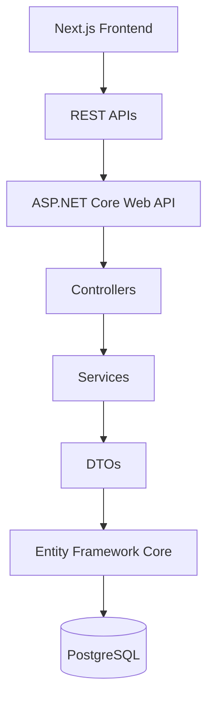

# Modern Architecture

```mermaid
flowchart TD
  A[Next.js Frontend] --> B[REST APIs]
  B --> C[ASP.NET Core Web API]
  C --> D[Controllers]
  D --> E[Services]
  E --> F[DTOs]
  F --> G[Entity Framework Core]
  G --> H[(PostgreSQL)]
```
